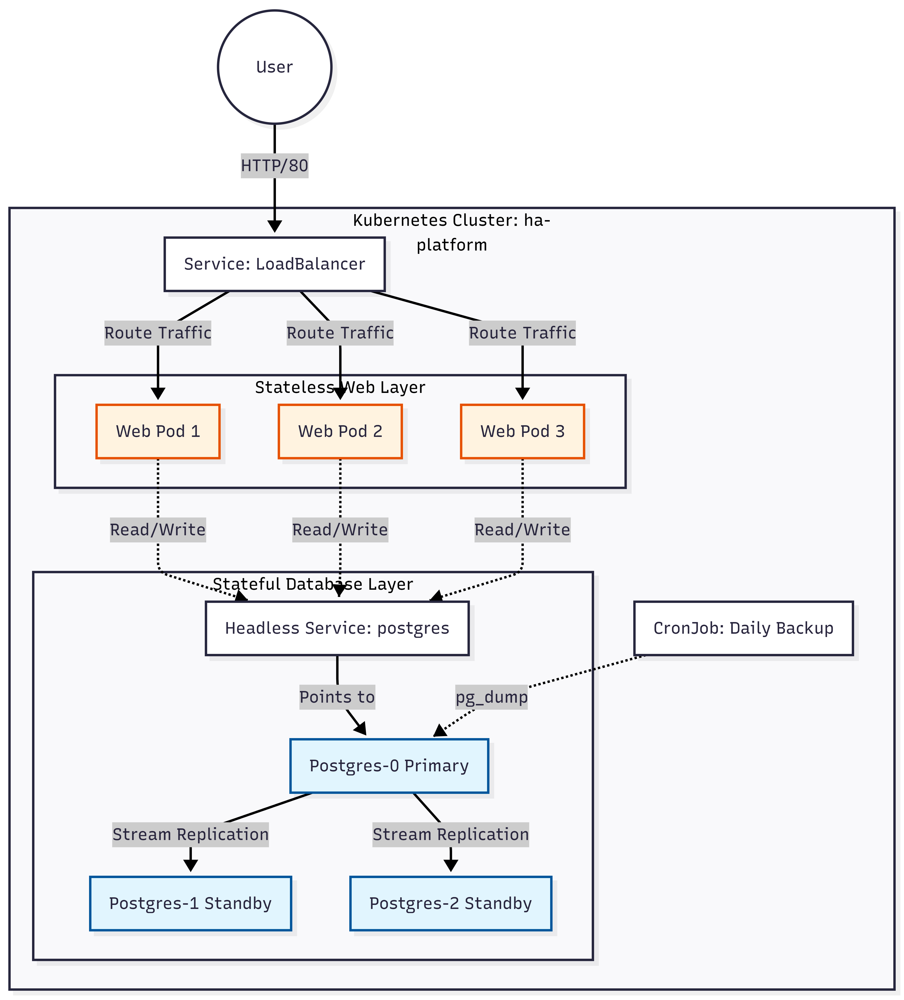
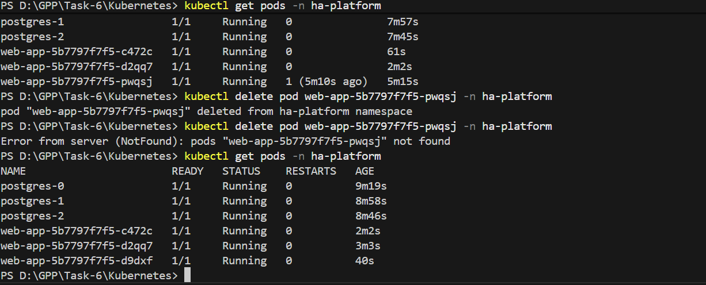

# High Availability Platform on Kubernetes

## 1. Project Overview
This project deploys a production-grade, highly available infrastructure on Kubernetes. It features a stateless web application connected to a replicated PostgreSQL database (StatefulSet) with automated failover, data persistence, and zero-downtime deployment capabilities.

### Architecture Diagram
[](images/Architecture-diagram.png)

---

## 2. Prerequisites
Before deploying the platform, ensure you have the following tools installed:
* **Docker Desktop** (with Kubernetes enabled = Kind).
* **kubectl** CLI tool configured to talk to your cluster.
* **Docker** (to build the local web application image).

---

## 3. Directory Structure
The project is organized as follows:
* `src/`: Python Flask source code and requirements.
* `k8s/`: Kubernetes manifest files (YAML) for all resources.
* `Dockerfile`: Build definition for the web application.
* `docker-compose.yml`: For local logic and schema verification.

---

## 4. Deployment Instructions

### Step 1: Build the Web Application Image
Since we are using a local cluster, we must build the image locally so the Kubernetes deployment can find it.

```bash
docker build -t my-web-app:v1 .
```

### Step 2: Deploy Infrastructure
Deploy the manifests in the following order to ensure dependencies (ConfigMaps, Secrets, Services) are ready before the applications start.

1. Configure Namespace and Secrets:
```bash
kubectl apply -f k8s/01-config.yaml
```

2. Setup Database Networking & Scripts:
```bash
kubectl apply -f k8s/02-db-service.yaml
kubectl apply -f k8s/03-db-scripts.yaml
```

3. Deploy the Database Cluster (StatefulSet):
```bash
kubectl apply -f k8s/04-db-statefulset.yaml
```

Wait for the database pods (`postgres-0`, `postgres-1`, `postgres-2`) to reach `Running` status before proceeding.

4. Deploy the Web Application:
```bash
kubectl apply -f k8s/05-web-deployment.yaml
kubectl apply -f k8s/06-web-service.yaml
```

5. Apply Resilience Policies & Backup Jobs:
```bash
kubectl apply -f k8s/07-resilience.yaml
kubectl apply -f k8s/08-db-backup.yaml
```

## 5. Verification
Once deployed, verify the resources in the dedicated namespace:

```bash
kubectl get all -n ha-platform
```

* Access the App: Open your browser to http://localhost.
* Verify Replication: Check logs of the standby database to confirm it is receiving data from the primary.

```bash
kubectl logs postgres-1 -n ha-platform
```

## 6. Evidence of Resilience
To demonstrate the platform's self-healing capabilities, a test was performed to verify that the Kubernetes Controller automatically replaces failed pods.

Since you are running on Docker Desktop (which is a single-node cluster), you cannot "drain" the node (because there is no other node for the pods to go to!).

Instead, we will demonstrate Pod Recovery by forcibly deleting a pod. The system should automatically detect this and start a new one.

### Test Scenario:
1. Identified a running web pod.
2. Forcibly deleted the pod using `kubectl delete pod <pod-name>`.
3. Observed the ReplicaSet immediately scheduling a replacement pod to maintain the desired state (3 replicas).

[](images/Pods-web-recovery.png)


## 7. Backup Strategy
A Kubernetes CronJob (`db-backup`) is configured to run daily at midnight. It executes `pg_dump` on the primary database instance to secure data snapshots.

To trigger a manual backup for verification:

```bash
kubectl create job --from=cronjob/db-backup manual-test-backup -n ha-platform
```